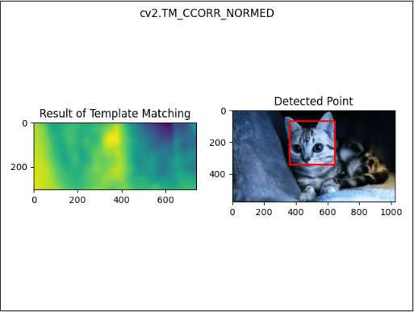
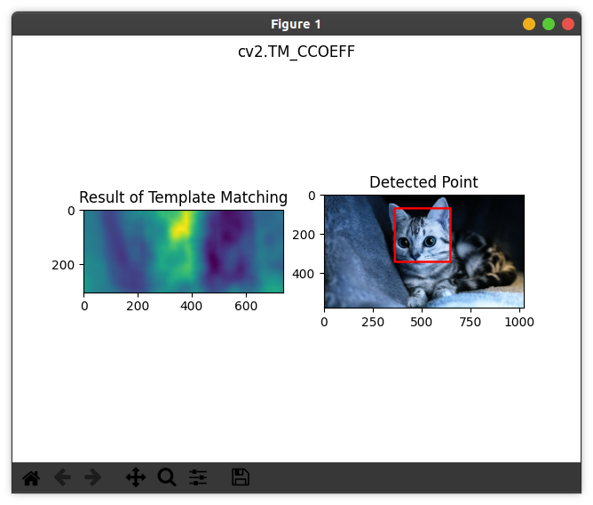
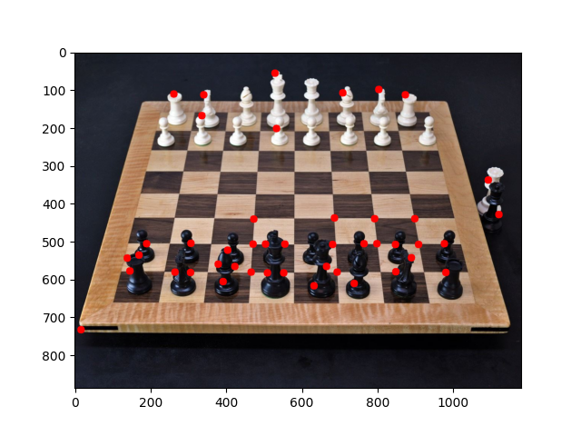
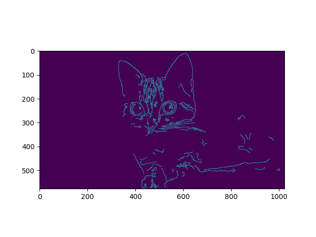
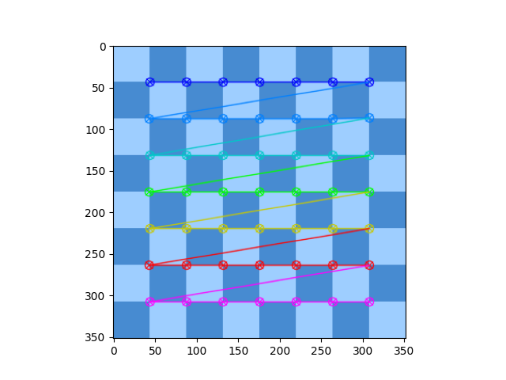
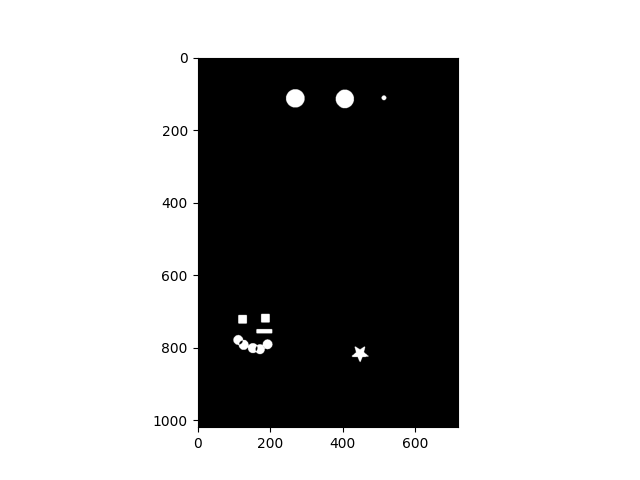
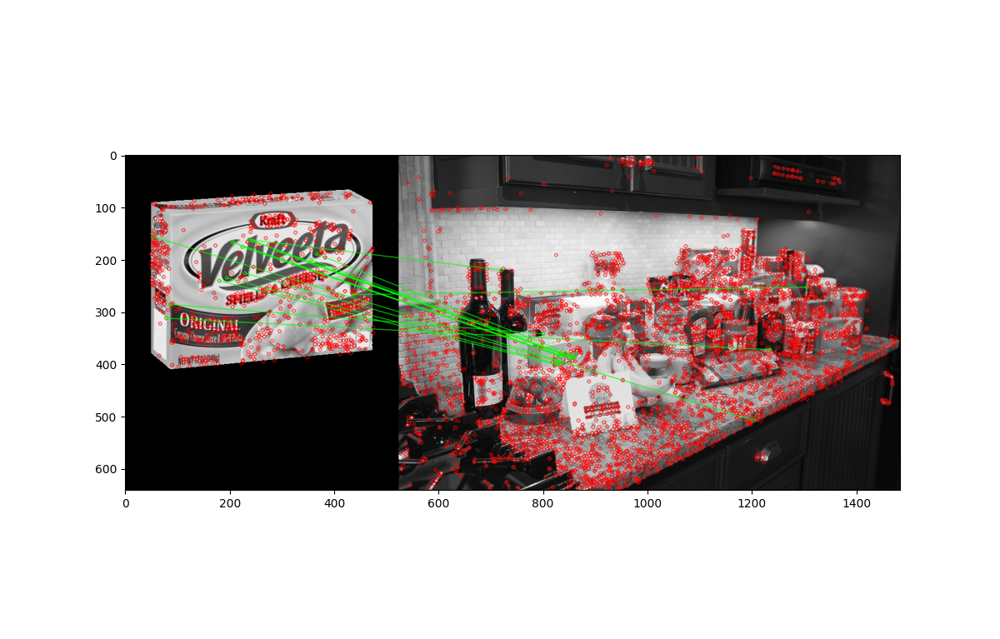

# Basic-Object-Detection
Some basic object detection algorithms used on images. 

  
Template Matching

 

  .

  .

  
Corner Detection

 

  .

  
Edge Detection

 

  .

  
Grid Detection

 

  .

  
Contour Detection

 

  .

  
Feature Matching

 

  .

  
Watershed Algorithm

 

  .

  
Custom Seeds with Watershed Algorithm

 

  .

  
Face Detection

 

  .

This repository is created by making use of "Python for Computer Vision with OpenCV and Deep Learning" course by Jose Portilla.
